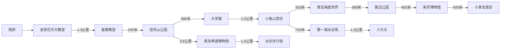

# 青岛旅行

## 市北区：

偏向陆地

> 栈桥：出了火车站就是，且就是一个桥.....夜景还能看一看
> 
> 
> 大学路上好像还有个老舍故居

## 市南区：

偏向沿海

> 情人坝、54广场具说夜景较好

## 崂山区：

这个太大了...... 至少得一天 ......

北九水\(好像就是劳山区附近\)

## 黄岛区

金沙滩:黄岛区\(不在老城区\),好像网上给的评价也不是太好

青岛新城吾悦广场:黄岛区\(不在老城区\),说是能吃到渔民的海鲜

东方影都:黄岛区\(不在老城区\)

## 必去

1. 栈桥
2. 圣弥厄尔大教堂
3. 信号山公园
4. 小鱼山
5. 第一海水浴场
6. 八大关
7. 奥帆中心
8. 五四广场
9. 青岛啤酒博物馆
10. 崂山

## 如果时间有冗余

1. 小青岛
2. 大学路
3. 小麦岛
4. 石老人海水浴场
5. 海军博物馆
6. 青岛海底世界

> 只是由于票比较难抢作为额外项。

## 总结

看着景区挺多，原本以为3天时间太短，肯定玩不儿完。主要，毕竟在北京呆多了，交通就很耗时，再加上一个故宫基本上就是一天。结果去了，青岛的所有景点真的不大。基本上一个景点最多2个小时，一天玩10个地方都有可能的。

总的来说，景点确实不少，也算是发达。有一半是免费的，尤其它的沙滩，孩子太喜欢了。挺好的。
