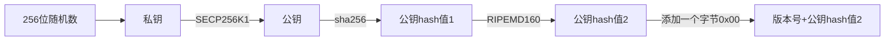
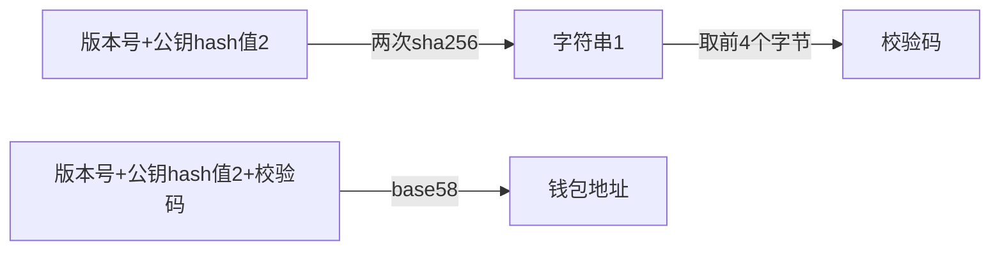

# 区块链-比特币

## 概览

2009 中本聪 开发出了比特币\(区块链\)，到现在2021年，也运行了12年了，很稳定。

从技术角度看它的核心：

1. 数据库\(k\-v\)
2. 防篡改\(hash函数\)
3. 去中心化（点对点、分布式=\>TCP）
4. 溯源\(链表\)
5. 匿名\(本要生成账号\)
6. 公开

从政府角度看：

1. 洗钱
2. 假账
3. 贪污

> 目前没人知道中本聪是谁，很神秘。
> 
> 
> 学完比特币，感觉这哥们算是个天才吧，不是智商多高，而在计算机领域、金融领域很强，完美的虚拟出一种货币，每个环节都考虑到了人性的贪婪......

**什么是比特币 ？**

比特币是一个软件系统，也可以说是一个协议。大家使用这个软件，实现了：点对点的虚拟货币交易。

> 实际并没有货币这个东西，也没有区块链的这个概念，后续介绍大家即会理解。

**什么是去中心化？**

人人都可以参与，没有公共server，任何参与的人，即可以是客户，也可以是提供服务方

> 也可以理解为分布式，如：zookper、consul、etcd

## 简单理解

假设现在我们有一些数据，比较关键，如财务报表，怕人做假账、篡改，于是：

1. 给这部分加密，但数据还要可见。给这部分数据加一个数字签名:hash\(data\)
2. 数据加完签名后，拥有者还可以随意更改，这个时候还要公开，任何人都可以下载。
3. 这个下载地址如果是单点的，会有挂了的可能，于是引入分布式系统，人人可以参与，人人可以下载。

最后，上传数据的人，最好得有个账户系统，但是我们想要匿名的，于是就有了本地生成账号功能

感觉好简单，分析下来看，几个核心的点：

1. hash函数加签名
2. 数据库
3. 分布式网络
4. 本地生成匿名账号\(公/私触\)

对应比特币里的术语就是：

1. 区块，用来存数据
2. 区块链，将每个区块上的数据连接起来
3. 交易，将数据打包发送给其它节点，其它节点验证后，就把数据最终写到区块上
4. 网络/广播：将交易的信息发送给全网，让其它节点验证。发现其它网络节点，从其它网络节点拉数据等
5. 地址/账号：就是生成匿名账号

比特币中常用的几个hash函数：

1. 比特币使用 SHA\-256和RipeMD160
2. 两次SHA\-256=hash256或者dhash
3. SHA\-256，再计算RipeMD160=hash160

## 广播/网络/整体流程

> 先从github下载代码

新节点启动后：想要参与全网，得先发现至少一个网络上的任意节点\(正常\)，并建立连接，且要连接成功。

> 协议使用TCP，8333端口。

如何发现节点？

1. 本地维护一个种子节点列表
2. 启动时，给程序指定IP

> 注：可以同时建立多个连接，不过，这个连接数没必要太多，浪费资源，保证有2\-3个够用了。

1. 连接建立后，简单的通信发包收包，确定都OK后，才算正常启动成功。被连接的节点，会把你节点的信息，再同步给其它节点，这样一个大网络就形成了。
2. 启动成功后，你也可以向已连接节点询问要其它对等节点的IP，然后断开这个连接，再连接这些对等IP
3. 任何节点又可以随时离开，如果你连接的节点突然断掉，你得赶紧再找一个新节点

> 每次启动连接成功的IP，它会记在本地，下次再启动的时候，也可以拿出来用，即：种子节点
> 
> 
> 已建立连接的节点，双方对定期做个心跳~发个包之类的。如果超过90分钟无包，断开连接

总之，感觉比特币的网络很松散随意自由

> 节点是扁平化的，没有所谓的国家地理之分

广播交易：轻节点将交易信息打包好，发送到其它节点等待确认

广播区块：节点挖到了一个新节点，发送其它节点等待确认

整个交易广播流程：

1. 轻节点/客户端:将交易进行打包，然后，推送到邻近\(已连接节点\)的网络中,3\-4个节点，包名：InvPacket/TXPacket
2. 邻近节点接收到此消息，向客户端发送：GetDataPacket，接收 TXPacket
3. 邻近节点对这笔交易进行验证，如果验证成功，将该交易加到自己的内存池\(交易池\)中，存储所有未被确认，未能写入到区块链中的数据。
4. 矿工会对这个池里的交易进行排序，比如：小费高的靠前，之后，统一选择一批交易，大概1M左右，开始进行挖矿。
5. 如果这期间，有其它新区块被发现，你拉回来数据，对比后，发现当前挖矿的交易列表中有相同记录，那么就可以剔除了，更新列表，重新挖。

这期间，也有可能别人挖出新块，需要你确认的。

会不会出现：A B 同时计算出新块，且同时被网络上其它人确认，即：两个新块均是合法的~那么就出现分叉了，

## 区块

一个区块=header\+body

> 跟http有点像，头里加个属性描述信息，体里是具体的数据.一个body最大：1MB左右

header

|key             |desc                                                    |len\(bytes\)|
|----------------|--------------------------------------------------------|------------|
|hash            |区块哈希                                                |            |
|Version         |区块版本号                                              |4           |
|pre\-hash       |上一个区块哈希                                          |32          |
|nBits           |target\(难度目标\)                                      |4           |
|root Merkle hash|数据被分成多段字符串，每段字符串进行hash，最后再汇总hash|32          |
|Nonce           |每计算一次hash,累加1                                    |4           |
|timestamp       |该区块的产生时间                                        |4           |

body

|              |           |
|--------------|-----------|
|Transaction\-1|UTXO1 UTXO2|
|Transaction\-2|UTXO1 UTXO2|
|...           |...        |

> body里牵扯的是交易部分后面讲，这里先分析下header

hash值就是此区块的唯一ID标识

> hash值=hash\(header里面每个字段的值\)

pre\-hash字段:分析看，类似链表的指针\(这里是hash值\)，也就是把若干个区块通过指针连接起来，感觉就是区块链的意思....

> 具说原本没有\<区块链\>的概念，只是因为是有点像是链表才有这个词

## 挖矿

> 从上面看，一个区块也没什么特别的，就是简单的结构体，有点DB\(kv\)的意思

给一个区块计算出一个hash值。看着其实挺简单，hash值=hash\(header里面每个字段的值\)

为什么挖矿特别慢呢？因为它得遵守一个公式，如下：

计算一个区块链的hash公式：

> SHA256\(SHA256\(version\+hashPrevBlock\+hashMerkleRoot\+ timeStamp\+ target\+ nonce\)\) \<= target

分析公式：右侧并不是等于号，而是\<=target，所以想一次hash实现不成立。那么，复杂的是hash值得满足target限定。

> target = target\_max / difficulty

difficulty:难度系数

target\_max:一个常量

> 很明显difficulty值越大 targete值就越小，而值越小，进行hash碰撞需要的计算量就越大

分析公式：这里除了nonce都是固定的，那么nonce就肯定得是一个随机数，通过随机数改变最终的hash结果，而这个随机数就是消耗时间，需要计算的关键点。

而计算header hash值就是：sha256\(header hash值 \+ Nonce\)

> Nonce：从1开始，每次累加1

所以，挖矿就是：计算Nonce值\(hash碰撞\<=目标值\)

接targete， 值越小，前面的0就越多，而正常在计算header hash值时是随机的0~9 a\-f 组成 ，能在最前面出现两个0：44

1. 3位是0的哈希值，理论上需要计算163=4096次，实际计算6591次：
2. 4位是0的哈希值，理论上需要计算164=6万5千多次，实际计算6万7千多次：
3. 5位是0的哈希值，理论上需要计算165=104万次，实际计算158万次：
4. 6位是0的哈希值，理论上需要计算166=1677万次，实际计算1558万次：

> 17位0：2.9万亿亿次

所以，影响计算次数的关键就是：target ，而POW就等于：Nonce值

最终验证其它人计算出来的hash值是否合法的公式：

> 新计算出来的hash值 \< target

Target每两周调整一次

比特币的一个hash值

> 0000000000000000000fbb90ac16fce1fa83d6908005548781a91c840fa10f17

为什么非要有个计算nnoce过程？

> 如果过快的产生结果，导致整体的计算会产生顺序性的混乱（保证广播到其它节点同步的顺畅），于是就加了个target值，简单说就是：你计算出来的hash值得满足一定的规则，如：前面必须得是以0000开头的...这就麻烦了，只能穷举了~

POW:Proof Of Work,工作证明，就是上面寻找的：nonce值

## 新的区块产生

当某一个节点计算出了符合条件的hash值后，将本次计算结果，发给邻近节点确定，超过6个节点确定没问题后：

1. 一个新的区块产生
2. 系统会奖励该节点N个比特币\(那么大家就都去挖矿了\)

每个区块都是动态生成的，在没有想要记录的数据前，区块是不存在的。只有：需要记录数据时，才会有人挖矿，才会有新的区块产生

> 这个挺好，用多少产生多少，没必要存到区块上的数据就不要传。

## 几个基础问题

**为什么要把数据记录在区块上？**

因为：它能保证绝对公平，谁也不能窜改，也不会丢失。所有的计算过程都是公开的，且被固定数量的节点确认过的。

**公网上的人如何确定？**

方法1：以接收时间为确认，那就是拼网速了，略有点不公平，

方法2：设计一个复杂的公式，最终看谁的机器配置高，计算能力强，同时再加上一点随机性，这样公网确认的机制就相对完整了

> 这也是为什么要挖矿，空算hash碰撞的原因之一

**如果需要复杂的计算，公网上的人为什么帮你算？**

于是就给了奖励：比特币

**那比特币到底能买什么东西？**

好像买不了啥，它就是个虚拟数字串，但是，当越来越多的人参与，想把越来越多的数据都记录到区块上，就得付佣金，而系统里如果只允许使用比特币做为佣金，那么，比特币看来也有点用。可依然没太大的作用，下面接着分析。

**什么样的数据需要记录在区块上？**

其实什么都可以上传，但因为可能要花佣金，那么，隐私（日志 视频）的数据就没必要传了，所以总结下来：财富相关的才值得上传。如：

1. 小明给了我10块钱
2. 我给了小明10块钱
3. 我买了一套房子A

这里有两种物体：10块钱 和 房子

因为区块上任何人安装完程序，都可以任意上传，这个时候B上传了：

1. 我还了小明给我的10块钱
2. 我买了一套房子A

虽然B传了的是正常的数据，但是B其实并没有给我10块钱，只是他自己胡乱记的，那么，区块链中的内容看来让用户随便记录就不太行了。得保证绝对财富的公平 。

比如：房子这个东西，你得保证唯一，A的房子卖给了我，B就不能再向A买了，B得找我来买。同样，B在没真的付钱之前，也不能卖A的房子

比如：10块钱，我付给了B，我就不能再花这10块钱了。

分析下来，无非就是需要给一个财富做成唯一属性，被A买完，卖的时候也只能是A可以。现实生活中很多东西不可能唯一 ，比如：各国的货币，名义上是有编号 ，实际上普通人印不了钱，政府完全可以偷印出两张ID一样的纸币。

所以，最终还要绕进来，使用比特币。因为它绝对公平，每产生一枚货币，需要经过全网确认，那么买卖东西，就使用这种货币就行了....

其实，对于使用者的核心诉求：把自己的数据记录到区块上。而，如果想要使用此功能就得花些钱，就得按照比特币的玩法，使用它自创建的一套货币体系。

## UTXO

Unspent Transaction Output：未花费的交易输出

直译过来有点别扭，我的理解：每一次付款产生的记录，最后统计每条记录的收款人的金额，就计算出一个账户的余额。

假设A当前有10个比特币 ，现在要向B买一杯咖啡需要2个比特币，生成UTXO：

|input             |\-\>|output      |
|------------------|----|------------|
|A转8个比特币给自己|\-\>|A有8个比特币|
|A转2个比特币给B   |\-\>|B有2个比特币|

> 统计A的账户余额，其实就是统计output,这里A还剩8个，B有2个

假设，这个时候，B想向C购买一袋咖啡豆，需要支持1比特币

|input             |\-\>|output      |
|------------------|----|------------|
|B转1个比特币给自己|\-\>|B有1个比特币|
|B转1个比特币给C   |\-\>|C有1个比特币|

> 付款的时候，就是拿上面已有output 输入到input

分析看：所有的交易记录，形成了一个链，都可追溯到源头。

一个比特币的源头：是挖矿时产生的，也就是coninbase，而第一个比特币就是中本聪的：创世区块上面的了.

假设，这个时候，C想向D买一公斤咖啡豆，需要支付0.01个比特币，本地将该交易打包发到网络上，发现迟迟没有响应，这个时候它加了点佣金：

|input                |\-\>|output         |
|---------------------|----|---------------|
|C转0.98个比特币给自己|\-\>|C有0.98个比特币|
|C转0.01比特币给D     |\-\>|D有0.01个比特币|
|C转0.01比特币给未知人|\-\>|               |

这里input=1比特币 ，而output=0.99

多出的的0.01比特币就会被矿工以\<贪婪模式\>吸收，并最后这笔转账的未知人写成矿工自己\(前提该矿工挖矿成功\)

这里有个问题，如何计算一个账户的余额？

1. 如果是一个新账号好说，所有都是新的，有进账就直接记录，有输出，也记一下
2. 非新账号，且本地没有任何UTXO记录，那么就得去遍历整个区块链的数据了，并且因为没有公钥地址，就只能拿当前账号去碰撞整个区块钱链的数据

## 交易

A 转 B 10个比特币，钱包会创建一条交易记录，然后再创建UTXO

input : A 已拥有的output

output: 转给B

将UTXO合成进这条新的交易记录中，打包生成一条完整的交易记录，然后将这条记录发送到网络上

网络中的某个节点，会拿到一堆类似的交易记录（不仅仅是A转B这一个），然后挖矿，创建一个新的区块

太工在把这些交易记录写到新的区块中时，同时添加两条新的UTXO记录，

1. 本次挖矿一但成功赚多少比特币
2. 佣金

然后，太工，打包所有交易记录，开始挖矿，计算HASH值...

详细，要做一笔交易分为三个步骤：

1. 构建原始交易记录 RawTransaction，包括：汇总信息，完成的output和完整的input，但是没有签名，也就是没有设置SignatureScript的内容。
2. 用私钥对签名构建的RawTransaction进行签名，并将签名构建成完整的解锁脚本，填入对应的Input的SignatureScript字段中。
3. 将签名后的Transaction发送到P2P网络中。

一条交易记录，格式：

|        |解释      |bytes|                         |
|--------|----------|-----|-------------------------|
|Version |版本号    |4    |                         |
|        |输入计数器|1\-9 |                         |
|TxIn    |交易输入  |不定 |是一个数组，可以包含多条 |
|        |输出计数器|1\-9 |                         |
|TxOut   |交易输出  |不定 |是一个数组，可以包含多条µ|
|LockTime|锁定时间  |4    |                         |

交易输入

|               |解释        |bytes||
|---------------|------------|-----||
|Hash           |HASH值      |32   ||
|Index          |输出索引    |4    ||
|               |解锁脚本大小|1\-9 ||
|SignatureScript|解锁脚本    |不定 ||
|Sequence       |序列号      |4    ||

交易输出

|        |            |    ||
|--------|------------|----||
|values  |总量/金额   |8   ||
|        |锁定脚本大小|1\-9||
|PkScript|锁定脚本    |不定||

一个交易\-\>多个input

一个交易\-\>多个output

一个input\-\>多个output

多个input\-\>一个output

一个交易，可以有N个INPUT和OUTPUT，神奇的是交易的时候，从来就没有看到真正的比特币参与，最多就是一个数字。所以，根本就不存在比特币这种货币，只有一条条UTXO

上面只是构建了交易的基础信息，那如何证明我的input是属于我的？接收者又如何确定只能自己才能接收？

这里用到两个点：

1. 签名
2. 公钥/地址

付款方在OUTPUT上设置锁定脚本

新交易的input肯定是之前的output,记做：pre\-output,现将pre\-output的信息，复制到新的input中

pre\-output这里面肯定带有一个锁定脚本，我们这时候创建一个解锁脚本，然后顺序执行这两个脚本

锁定脚本包括：几个字符串\+操作码

解锁脚本包括：是两个字符串（私钥签名\+公钥地址）

将两个脚本合并 ，把解锁放在上面，再准备一个栈，开始执行：

解锁脚本放在前面执行，也就是将两个字符串压入栈中，然后开始压入锁定脚本，流程过，大概是：

解锁中带的数据：公钥，通过HASH函数能推出地址，就证明这个公钥跟地址是相等的，证明确实是收款方

解锁中带的数据：私钥签名，再用公钥解销这个签名，看是否正确，就证明：公钥也是没问题的

加锁的时候就是把这个流程反过来

好像只是填写了对方的地址....其余的是常规hash函数...

所以，从这里看到地址到底有什么用了.

解锁脚本\-\>ScriptSig

锁定脚本\-\>scriptPubKey

## 传输

计算出来的hash串，得通过网络传输给参加的玩家（N个人），最后再传回公链上。那么，两个关键点

1. 好的网络
2. 计算块的元数据较小

传输的速度也就过快，被上传到公链上的概率也就是越高

比特币是由发掘新区块的计算过程中产生，也就是说 区块链 约等于 比特币 ，或者说 区块链是底层实现技术，而比特币是区块链技术的上层应用程序。

分析整个流程，好像共赢，想要记账上公链的人，只需要把数据抛出来，而矿工虽然耗费电力 CPU，但是还能拿到虚拟币，看着皆大欢喜呢...\(费解~\)

## 问题

双花

分叉:网络上同时可能有多次交易，需要多次进行HASH验证（挖矿）

手续费

## 钱包

私钥：随机生成一个数字，256个二进制位（2^256），64个十六进制字符

公钥：由私钥导出

地址：公钥导出，数字\+字母，以1开头，58个字节

  

**地址到底是有什么用？**

底层技术是给UTXO交易时使用，正常理解是：一个账户名

因为这个账号是经过各种加密函数生成，所以一但丢了，不可逆，即：丢失后，所有比特币一并丢失.

keystore:防盗，给私钥再加密一次，生成新串，加密时设置密码

密码：防盗，解开keystore成正确的私钥

助词词：防盗，设置几个词，然后转换出正确的私钥

所以，看上面的核心就是：私钥，而钱包就是帮忙管理私钥的一个指令行转UI的工具箱。它帮忙你省略了：各种函数，生成私钥，私转公，公转地址的过程。同时有一个忘记私钥的功能...

## 节点类型

一个节点\-包含模块：

|模块名    |说明                                                                                      |
|----------|------------------------------------------------------------------------------------------|
|完整区块链|就是整个比特币所有的区块信息，大概250G左右，首次启动，要从其它节点下载到本地，有点占硬盘哈|
|钱包      |打包交易，发到公网，接收确认消息等                                                        |
|矿工      |接收其它人发送的交易，打包，挖矿                                                          |
|网络路由  |提供些网络广播的操作                                                                      |

> 因为这东西必须得用网络，所以 网络路由肯定是公共模块

全节点：钱包，矿工，完整区块链数据，网络路由节点

> 并没有绝对的server，一个节点即可以像客户一样发起交易，也可以像太工一样，去挖矿，因为它本地就有所有数据。

轻节点：SPV，网络路由节点。只保存了与自己相关数据的header及相关的body

> 我们日常下载的钱包，基本就是轻节点

矿工：矿工，完整区块链数据，网络路由节点

> 其实也不一定用完整的数据，可以调用3方，最后只执行挖矿的功能媃中,上面属于独立矿工

两个暂存服务器：pool stratum

具说，现在大概有7000\-10000个全节点，也就是说：一条交易，最终会被这10000个节点所记录。

## 挖矿奖励与佣金

我刚接触的时候觉得，SB才会给佣金，因为矿工本就有奖励为毛还给小费？

但，当挖矿比较容易的时候，佣金好像没啥鸟用，但现在产出一个新区块的概率太TMD低了，而且，越往后越低，到最后就没有了。这个时候，光靠系统的奖励对矿工没啥动力，还得支付点额外的小费。

前21W个区块，每次挖矿奖励是50个，之后是25，然后是12.5个....最终：只会产生2100W个比特币

分析看：当产出新区块的概率越低，佣金就会越高

## 总结

区块链的两个核心技术点

1. 匿名：根据特定函数随机生成个串字符串，约等于UID，无须验证，无须注册，无须联网，也就是无法追踪...
2. 无法篡改：所有数据通过加密，谁都无法改

公有链：完全公开，

许可链：某一个领域的，对隐私保护较好，成本低

https://tokenview.com/

https://btc.com/

