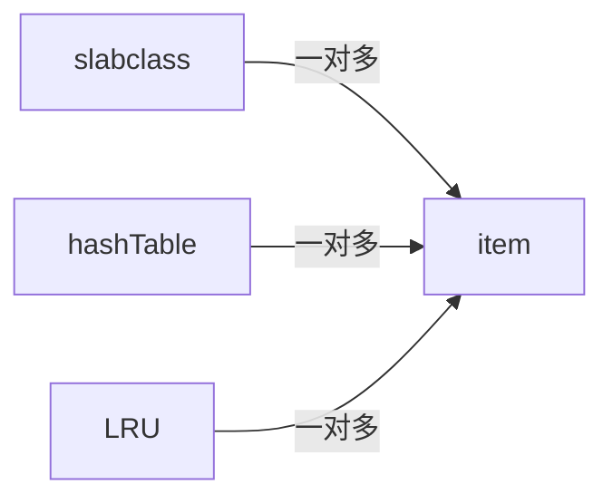

# 概览

# 进组/线程

单线程 + 多线程 = 主线程 + 工作线程

## 主线程

主要功能：负责 socket 监听 、接收网络的 IO、解析指令、维护 session 、将工作指令分发给 工作线程

1. 初始化 lib event
2. 创建/初始化 工作线程
3. 初始化 pipe ，用于线程间通信
4. 初始化内存
	- 申请物理内核
	- 创建 slab
1. 初始化 hashTable

使用了 libevent 库

# 内存管理

memcache 采用的是部分预先分配内存，即：在启动时，就把你给它的部分内存空间使用上，进行格式化，等数据的到来，再逐步申请内容 

开始是申请大概 256个 slab 

## item

```C
typedef struct _stritem {
	//记录下一个item的地址,主要用于LRU链和freelist链
	struct _stritem *next;
	//记录下一个item的地址,主要用于LRU链和freelist链
	struct _stritem *prev;
	//记录HashTable的下一个Item的地址
	struct _stritem *h_next;
	//最近访问的时间，只有set/add/replace等操作才会更新这个字段
	//当执行flush命令的时候，需要用这个时间和执行flush命令的时间相比较，来判断是否失效
	rel_time_t      time;       /* least recent access */
	//缓存的过期时间。设置为0的时候，则永久有效。
	//如果Memcached不能分配新的item的时候，设置为0的item也有可能被LRU淘汰
	rel_time_t      exptime;    /* expire time */
	//value数据大小
	int             nbytes;     /* size of data */
	//引用的次数。通过这个引用的次数，可以判断item是否被其它的线程在操作中。
	//也可以通过refcount来判断当前的item是否可以被删除，只有refcount -1 = 0的时候才能被删除
	unsigned short  refcount;
	uint8_t         nsuffix;    /* length of flags-and-length string */
	uint8_t         it_flags;   /* ITEM_* above */
	//此 item 属于哪个 slabclass_t 
	uint8_t         slabs_clsid;/* which slab class we're in */
	uint8_t         nkey;       /* key length, w/terminating null and padding */
	/* this odd type prevents type-punning issues when we do
	 * the little shuffle to save space when not using CAS. */
	//数据存储结构
	union {
		uint64_t cas;
		char end;
	} data[];
	/* if it_flags & ITEM_CAS we have 8 bytes CAS */
	/* then null-terminated key */
	/* then " flags length\r\n" (no terminating null) */
	/* then data with terminating \r\n (no terminating null; it's binary!) */
} item;
```

它可以分成两部分：元数据 + 数据

data：CAS + key + stuffix + value

item 与 item 之间是有连接的
item 与 slab_class 也互有联系

过期时间也记录在这里

## slab_class

slabclass_t 结构体：

```C
typedef struct {
    unsigned int size;      //slab分配器分配的item的大小/当前的slabclass存储最大多大的item
     //每一个slab分配器能分配多少个item/每一个slab上可以存储多少个item.每个slab大小为1M， 可以存储的item个数根据size决定。
    unsigned int perslab;
	//当前slabclass的（空闲item列表）freelist 的链表头部地址
	//freelist的链表是通过item结构中的item->next和item->prev连建立链表结构关系
    void *slots;           //指向空闲item链表
    //当前总共剩余多少个空闲的item
    //当sl_curr=0的时候，说明已经没有空闲的item，需要分配一个新的slab（每个1M，可以切割成N多个Item结构）
    unsigned int sl_curr;   //空闲item的个数
    //总共分配多少个slabs
    unsigned int slabs;     //本slabclass_t可用的slab分配器个数

    void **slab_list;       //slab数组，数组的每一个元素就是一个slab分配器，这些分配器都分配相同尺寸的内存
    unsigned int list_size; //slab数组的大小, list_size >= slabs

    size_t requested; //本slabclass_t分配出去的字节数
} slabclass_t;

#define MAX_NUMBER_OF_SLAB_CLASSES (POWER_LARGEST + 1)
//数组元素虽然有MAX_NUMBER_OF_SLAB_CLASSES个，但实际上并不是全部都使用的。
//实际使用的元素个数由power_largest指明
static slabclass_t slabclass[MAX_NUMBER_OF_SLAB_CLASSES];//201
static int power_largest;//slabclass数组中,已经使用了的元素个数.

```

每个 slab 是 1M(默认，可调)内存空间
一个 slab 又被划分成 若干个固定内存大小的 chunk
每个 chunk 保存一个 item

但 slab 是可变的，对应 chunk 的大小也是可变的

最终所有的 slab 被保存在 slabclass_t 中

slab_class 又保存 slabclass_t

> slab_class 是个数组

slab_class 就可以理解为： memcache 中实际管理（分配）物理内存的类。

每个 slabclass_t 中的 item 大小不是固定的，memecached 有启动，初始化时，好像是以2的N次方递增创建

## hashTable

item 的地址会被存于 hashTable 

当查找一个 item 的时候，用 hashTable 做检索

## LRU

Least Recently Used 近期最少使用算法，当内存满后，新进来要存储的数据，会找到不被使用却占用内存的数据，覆盖

启动时，会创建两个全局变量：heads[] tails []  指向 4个数组:LRU list 
```
static item *heads[LARGEST_ID]; //指向各slabclass的LRU链表的head结点  
static item *tails[LARGEST_ID]; //指向各slabclass的LRU链表的tail结点
```

因为默认会创建 200个 slab_class ，对应的：  
heads[0-63] : HOT
heads[64-127]:warm
heads[128-191]:COLD
heads[192-256]:TEMP


每创建一个 slab_class_t 就会连带着创建4个 LRU 链表：HOT WARM COLD TEMP 

4个数组中的所有 LRU 链表由 一个线程：maintainer，统一管理

清除超时与flushed的item

## 小结

这4个分类基本上就是 memcache 的核心，其关系




被操作的节点就是 item ，剩下的都是管理它的组件

# 操作流程

## 插入

先去 LRU 找，如果有直接使用
再去  free list 找，如果有直接使用
创建一个新的 slab

## 删除 

并不是直的删除，而是将此item 转移到 free list 中


## 一致性哈希

假设有 A B C D E 五台机器，KEY：1 2 3 4 5 ， 机器名 key mod 5 = 落到 哪台机器，如果我再新加一台 F，该算法失效。

算法改进：

给每台机器设置一个 整数范围，比较大的

A：0~100000
B：0~200000
C：0~300000
D：0~400000
E：0~500000

计算一个 KEY 落到哪台机器的算法：先把 KEY 用 CRC32(hash 函数)，计算出来一个数字值，如果在 500000 以内，挑一个距离 最近 的机器，如果大于 500000，就跟 500000 取个余数

这个时候增加一台机器 F，因为最大值已经设定为 500000，所以取值只能 在 500000 之内，看一下这 5 台机器哪负载比较高，假如 A 比较高，那就给 F 的取值范围为：150000~199999

F：150000~199999

A：100000~149999 改变

新算法：当一个 KEY hash = 150001，原先之前肯定是落 在服务器 A，这个时候加个判断如果<150000 去 A，如果大于则去 F 服务器。

再看一下如果某一台服务器挂机了，假设 E 挂机了

现在有个 KEY 为 450000，按正常来说应该落 到 E 上面，但 E，PING 不通，于是循环，找一个距离它最近的服务器，E 后面没有服务器了，那就循环，A 是最近的。于是落 到 A 上。

当前线程数

一、缓存命中率 = get_hits(总命中次数)/cmd_get \* 100%

二、get_misses 的数字加上 get_hits 应该等于 cmd_get

三、total_items == cmd_set == get_misses，当可用最大内存用光时，memcached 就会删掉一些内容，等式就会不成立

memcached/scripts/memcached-tool
