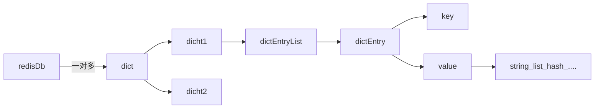

# 概览

主要是两个功能 ：
1. 内存缓存
2. NoSql-DB

## 内存缓存
使用最多的，效果最好的，且是接触最早的，因为：DB抗不了太大的压力，使用缓存能瞬间提升性能，效果立竿见影。
>尤其，早期使用 memcached ，再用 redis 就是当成它的替代品

具体的使用场景：
1. 复杂的DB-SQL-QUERY ，读一次就行了，剩下的直接从缓存拿数据
2. 复杂的DB-SQL-QUERY，需要二次计算、联表查询的，走缓存
## NoSql-DB

1. 一些统计类的数据，像：签到、PV/UV、阶段性访问人数、每天的访问UID
2. 复杂的数据结构：队列、列表、集合、GEO、bitmap等
3. 简单的数据，不需要存DB的，KV类型的

# 线程组

6.0 以前：主线程 + 后台线程
6.0 以后：主线程 +  woker 进程组 + 后台线程

网络模式：SELECT/Epoll/kqueue/

6.0 之后，主线程 换成了多线程：

- 把网络 IO 性能提上来。
- 指令阻塞（删除某个大 KEY 的时候）

## 主线程

主线程（6.0 以前）：网络 IO 、指令解析、执行指令，返回结果。
主线程（6.0 以后）： 指令解析、执行指令，返回结果

 wokrder进程组：网络 IO 

> 我猜：redis 的 瓶颈是在内存管理上，而不是 CPU。在网络 IO 与指令 IO 上，单线程应该是够。如果加上多线程，肯定得上锁机制、线程安全等等，太复杂。

## 后台线程

持久化、异步删除、主从复制、过期处理、主从复制

3类线程：
1. BIO_CLOSE_FILE：关闭文件FD。
	- AOF / RDB 产生的临时文件
	- 副本数据同步过程中的临时文件（比如 RDB 文件）
	- socketFD	
1. BIO_AOF_FSYNC：aof 追加指令、aof 重作日志   
2. BIO_LAZY_FREE：异步删除，主要是删除大 key。（del unlink flushall flushdb）

每个线程都有一个队列，主线程会发送消息给队列，这3类线程来做为消费

>前两个，是直接跟文件写操作有关，最后 个是间接跟内存写有关

## 辅助线程

RDB ，每次快照时，他 创建一个新的线程 bgsave

 

### 主进程


死循环中：

定时器：在 select timeout 时间超时之前，去执行定时器
定时器会取一个 小根堆里 取里面的要执行的函数

更新服务器的各类统计信息，比如时间、内存占用、数据库占用情况等
清理数据库中的过期键值对
对不合理的数据库进行大小调整
关闭和清理连接失效的客户端
尝试进行 AOF 或 RDB 持久化操作
如果服务器是主节点的话，对附属节点进行定期同步
如果处于集群模式的话，对集群进行定期同步和连接测试

# 底层数据结构与算法 ：

[为了拿捏 Redis 数据结构，我画了 40 张图（完整版） - 小林coding - 博客园](https://www.cnblogs.com/xiaolincoding/p/15628854.html)


## sds

### C 字符串问题

C 语言中是使用 char \*/chat[] 来存储 string，这里有 3 个问题：

1. 如果计算 string 长度是 O(n)
2. 添加操作，可能会对内存多次重新分配
   > 字符串拼接可能有溢出风险，需要重新分配 。字符串缩减可能有泄露风险，，需要重新分配
3. 二进制安全？
   > C 没有真正的字符串，但有字符串概念，在字符串末尾加上：\0
   > 数据 + \0 = 字符串，这里有个问题，一但 数据中包含 \0，那 len 函数就会错误，也就是数据不安全
   > 字符串常量：数据不可更改。字符串数组：可任意更改
   > 不管是 指针 还是 字符数组，最终都会在末尾加上：\0
   > 总结：C 语言的字符串并不单独计算长度，且数据与分隔符混用了

所以，redis 又封装了一个新的结构体 sds ，在日常操作字符串就都使用这个结构体，不直接操作 char \*

Simple Dynamic String

```c
typedef char *sds;
struct sdshdr {
    // buf 已占用长度
    int len;
    // buf 剩余可用长度
    int free;
    // 实际保存字符串数据的地方
    char buf[];
};
```

解决的问题：

1. 加了个索引项，当需要计算长度时，直接读取该项值 O(1)
2. 加了个剩余长度，申请内存的时候，多申请一小块，追加时，避免内存重新分配(动态扩容)
3. 明文了已用未用空间大小，在字符串操作的时候，避免了 溢出
4. 明文了已使用长度，即使数据中包含 \0 依然可以正确使用
5. 真正存数据并不是以字符，而是字节为单位存储。这样就兼容了二进制

未使用：空间的动态分配：
value < 1mb ，申请 value \* 2
value > 1mb , 申请 1m

这就是空间换时间，会有一定的内存浪费

3.5 之后 redis 对 sds 继续优化，上面的 sds 结构体，变成了 5 个：
sdshdr5 sdshdr8 sdshdr16 sdshdr32 sdshdr64

```c
struct __attribute__ ((__packed__)) sdshdr64 {
	uint64_t len; //已使用
	uint64_t alloc; // 总共可用的字符空间大小，应该是实际buf的大小减1 (因为c字符串末尾必须是 \0, 不计算在内)。
	unsigned char flags; // 标志位，主要是识别这是sdshdr几，目前只用了3位，还有5位空余
	char buf[];  // 实际存储字符串的地方 其实就是 C 原生字符串+部分空余空间
};
```

大体上：

- 整形单独存，基本上 3~4 个字节妥妥够
- 小字符串，单独存
- 大字符串，也单独存

Sdshdr5: 存储字符串长度区间为[0, 1<<5)之间, 没有 Len 和 Alloc 字段,只有一个 Flags 字段,整个 sdshdr5 占用 1Byte
Sdshdr8: 存储字符串长度区间为[1<<5, 1<<8)之间, Len 和 Alloc 字段都占用 1Byte, 整个 sdshdr8 占用 3Bytes
Sdshdr16:存储字符串长度区间为[1<<8, 1<<16)之间, Len 和 Alloc 字段都占用 2Bytes, 整个 sdshdr16 占用 5Bytes
Sdshdr32:存储字符串长度区间为[1<<16, 1<<32)之间, Len 和 Alloc 字段都占用 4Bytes, 整个 sdshdr32 占用 9Bytes
Sdshdr64:存储字符串长度区间为[1<<32, 1<<64]之间, Len 和 Alloc 字段都占用 8Bytes, 整个 sdshdr64 占用 17Bytes

![[redis_sds_struct.png]]


## ziplist

看名字叫压缩列表，但它是：对内存的优化，虽然外看是链表。但元素内并不存 next prev ，它实际是个 char 类型的数组

ziplist 内部结构：

```
area        |<---- ziplist header ---->|<----------- entries ------------->|<-end->|

size          4 bytes  4 bytes  2 bytes    ?        ?        ?        ?     1 byte
            +---------+--------+-------+--------+--------+--------+--------+-------+
component   | zlbytes | zltail | zllen | entry1 | entry2 |  ...   | entryN | zlend |
            +---------+--------+-------+--------+--------+--------+--------+-------+
                                       ^                          ^        ^
address                                |                          |        |
                                ZIPLIST_ENTRY_HEAD                |   ZIPLIST_ENTRY_END
                                                                  |
                                                         ZIPLIST_ENTRY_TAIL
```

- zlbytes 压缩列表所占用的字节（包括本身占 4 个字节），当重新分配内存的时候使用，不需要遍历整个列表来计算内存大小。
- zltail ：表中最后一项（entry）在 ziplist 中的偏移字节数。可以很方便地找到最后一项（不用遍历整个 ziplist），可以在 ziplist 尾端快速地执行 push 或 pop 操作。
- zllen：压缩列表包含的节点(entry)个数
- entry:表示真正存放数据的数据项，长度不定。一个数据项（entry）也有它自己的内部结构。
- zlend: ziplist 最后 1 个字节，值固定等于 255，其是一个结束标记。

entry 内部结构：

```
area        |<------------------- entry -------------------->|

            +------------------+----------+--------+---------+
component   | pre_entry_length | encoding | length | content |
            +------------------+----------+--------+---------+
```

prevlen：前一项的长度。方便快速找到前一个元素地址，如果当前元素地址是 x，(x-prelen)则是前一个元素的地址
encoding：当前项长度信息的编码结果。比较复杂，稍后介绍
data：当前项的实际存储数据

它的核心就是：把数组改成链表来使用

数组的优点：

1. 连续的内存空间，不会有内存碎片。
2. 带有下标，可以快速检索

数组的缺点：

1. 表头 表尾 可以快速检查，但是表的中部数据检查起来很麻烦
2. 插入/更新，最快的情况，可能整个链表都要重新进行内存分配

个人总结：ziplist 可以节省内存，提高一定的检查效率。不适合大数据，一但发现内存重新分配 或 查询中间数据的时候就吃力了。

## quickList

具说 3.2 版本以前是 linkedlist ，比较典型的双向链表，其中内容存储项：value 指向 SDS。缺点就是：遍历慢，next prev 吃内存。

quickList 更像是对 ziplist 的索引（类似：2-3 树/基排序/跳表的感觉）。 其内部的元素都是指向 一个 ziplist 结构

```c
typedef struct quicklist {
    //指向头部(最左边)quicklist节点的指针
    quicklistNode *head;
    //指向尾部(最右边)quicklist节点的指针
    quicklistNode *tail;
    //ziplist中的entry节点计数器
    unsigned long count;        /* total count of all entries in all ziplists */
    //quicklist的quicklistNode节点计数器
    unsigned int len;           /* number of quicklistNodes */
    //保存ziplist的大小，配置文件设定，占16bits
    int fill : 16;              /* fill factor for individual nodes */
    //保存压缩程度值，配置文件设定，占16bits，0表示不压缩
    unsigned int compress : 16; /* depth of end nodes not to compress;0=off */
} quicklist;
```

```c
typedef struct quicklistNode {
    struct quicklistNode *prev;     //前驱节点指针
    struct quicklistNode *next;     //后继节点指针

    //不设置压缩数据参数recompress时指向一个ziplist结构
    //设置压缩数据参数recompress指向quicklistLZF结构
    unsigned char *zl;
    //压缩列表ziplist的总长度
    unsigned int sz;                  /* ziplist size in bytes */
    //ziplist中包的节点数，占16 bits长度
    unsigned int count : 16;          /* count of items in ziplist */
    //表示是否采用了LZF压缩算法压缩quicklist节点，1表示压缩过，2表示没压缩，占2 bits长度
    unsigned int encoding : 2;        /* RAW==1 or LZF==2 */
    //表示一个quicklistNode节点是否采用ziplist结构保存数据，2表示压缩了，1表示没压缩，默认是2，占2bits长度
    unsigned int container : 2;       /* NONE==1 or ZIPLIST==2 */
    //标记quicklist节点的ziplist之前是否被解压缩过，占1bit长度
    //如果recompress为1，则等待被再次压缩
    unsigned int recompress : 1; /* was this node previous compressed? */
    //测试时使用
    unsigned int attempted_compress : 1; /* node can't compress; too small */
    //额外扩展位，占10bits长度
    unsigned int extra : 10; /* more bits to steal for future usage */
} quicklistNode;
```

quicklist -> quicklistNode ->ziplist

![[redis-QuickList.png]]
## hashTable

```c
typedef struct dictht {
    dictEntry **table;             // 哈希表数组，指向  dictEntry
    unsigned long size;            // 哈希表数组的大小
    unsigned long sizemask;        // 用于映射位置的掩码，值永远等于(size-1)
    unsigned long used;            // 哈希表已有节点的数量
} dictht;

```

```c
typedef struct dictEntry {
    void *key;                  // 键
    union {                     // 值
        void *val;
        uint64_t u64;
        int64_t s64;
        double d;
    } v;
    struct dictEntry *next;     // 指向下一个哈希表节点，形成单向链表
} dictEntry;

```

比较简单，就是：数组+链表

数组：通过一个 hash 函数计算出 数组的下标，O(1)，满足 hash 的查询复杂度
链表：key 冲突的时候使用

这里是redis 做个优化，单个 dictht  数组如果过小且对应的值过多，冲突就会加大，它还引入了另外一个结构：

```c
typedef struct dict { 
    dictType *type; 
    void *privdata; 
    dictht ht[2]; 
    int reshaidx; 
} dict; 
```

大体上的思路：就是再创建一个新的数组，间接算是扩容吧，再新创建一个 dict 结构体，管理两个 dictht 数组

当 hashTable 过大时，会改成 ziplist 存储：

- 数据长度小于 64
- 列表长度小于 512


## intset

```c
typedef struct intset {
	uint32_t encoding;
	uint32_t length;
	int8_t contents[];
} intset;
```

比较简单，就是一个数组保存数据。不过，这只是 redis 其中的一个数据结构，小数量量还是不错的。

## skipTable


小数据且整形依然可以使用 setint

```c
typedef struct zset{
     //跳跃表
     zskiplist *zsl;
     //字典
     dict *dice;
} zset;
```

跳表：就是在一个有序的链表基础之上，再建立 1 级索引，以二分法的方式建立。这样搜索更快。

为什么不单独使用字典？
字典是无序的，查找快，但是排序不行。

为什么不单独使用跳表？
可以范围查找 ，但是具体 找某个值会很慢

```cpp
typedef struct zskiplist{
     //表头节点和表尾节点
     structz skiplistNode *header, *tail;
     //表中节点的数量
     unsigned long length;
     //表中层数最大的节点的层数
     int level;

}zskiplist;
```

```cpp
typedef struct zskiplistNode {
     //层
     struct zskiplistLevel{
    //前进指针
    struct zskiplistNode *forward;
    //跨度
	unsigned int span;
	}level[];
		//后退指针
		struct zskiplistNode *backward;
		//分值
		double score;
		//成员对象
		robj *obj;
} zskiplistNode
```


# 基础数据结构


| 名称       | 分类 | 底层结构            |
| ---------- | ---- | ------------------- |
| String     | 基础 | SDS                 |
| List       | 基础 | quickList   |
| Set        | 基础 | intset hashTable    |
| Sorted Set | 基础 | zipList + skipTable |
| Hash       | 基础 | zipList + hashTable |

## string

最简单的结构类型，可以存在任何数据：字符、数字、二进制

### 操作数字

set age 18 ex 10 NX 
设置 年龄=18岁 ，10秒后超时，键值必须不存在

incr age
年龄+1

decr age
年龄-1

get age
18

### 操作字符串

set name zhangsan
APPEND key value ：如果 KEY 是 STRING，在末尾追加
### 二进制/BitMap

有时候场景可以使用上，如：

1. 统计一个用户，一年的登陆次数
2. 统计用户的签到次数
3. ......

主要是日常统计中，非黑即白的情况，bit 正好就是两个数 0 和 1

redis 的 sds 是数据安全，支持二进制的，间接就是原生 支持 bit 操作的。

## list

类似一个队列吧，有顺序的插入元素，元素值可以重复，可以是字符/数字

## hash

就是普通的字典/hashTable
## set

集合，字符/数字都能存，但不允许重复。

数据量大且是字符类型： hashTable
数据量小且是数字类型： intSet

## zset

集合，字符/数字都能存，有序的，但不允许重复。

# LUA

2.6 之后  redis 开始支持的，算是对 redis 的补充吧。
redis 设计 之初就是：单条指令执行，既然事务也一样是单条处理。如果加入更多的复杂的处理，太复杂，性能、维护成本都是问题。另外，C语言是静态的，加入lua  可以做些动态的扩充。总之就是：LUA 对 redis 的扩展及功能是非常好的。

# key 的存储结构

redis 中所有的 key 是用的底层 hashTable 结构，如下：



一维数组+链表结构


# 高级用法

## HyperLogLog

基数统计：一个集合内，把重复的多个元素计为 1，非重复的也计为 1，最终统计出总数

常规的统计算法肯定性能不行，得用：HyperLogLog 算法

HyperLogLog：是一个算法 ，并不是 redis 独有

redis 随着使用的人数过多，也开始加入了一些新的算法。主要：日常使用 redis 除了缓存 也就是统计了，加点常用的算法 也挺好。

其实，如果自身语言支持 或 干脆下个开源库，redis 这个就有点多余。个人觉得，用处如下：

1. 有些程序员就不会写这个算法，也下不到这个算法，或者就是懒
2. 本机的计算量有限，交给 3 方机器来计算，省点资源
3. 它的算法对性能控制还是比较好的

具说，12KB 内存能计算 2^64 个数字

### HyperLogLog 算法

从 loglog 算法 派生而来，用于确定非常大的集合的基数，而不需要俱其所有值。
是个概率的，并非精准统计。误差率：0.81%。

如：统计多少个用户访问了网站，正常用个简单的 set 即可，随着时间增长，UID 越来越多，计算量就有点大了。

算法有几个公式，看不下去，看不懂，有兴趣的自己百度吧

## 发布订阅

publisher channel subscriber

发布一条消息:

> publish channel:1 hi

订阅一个通道，用于接收消息

> subscribe channel:1

channel 支持 通配符：
如：有 2 个管道叫 order order_pay

如果监听的是: order\* ，那这两个 channel 发来的消息，都会接收到

缺点：

1. 持久化
2. 没有 UI 管理
3. 没有 channel 管理
4. 安全 acl
5. 流控
6. ack 确认机制
7. ......

优点：

1. 超级简单，没有任何配置，直接开干

总之，有点小儿科，小项目玩玩儿还行，大点的项目不可能用它来做 订阅发布，像：

1. 专门的队列系统 rabitmq rocketmq kafka
2. 专门的分布式系统 etcd/consul/zookeeper

## Geospatial

主要是计算经纬度的，其它文章有讲解，这里不做讲解了。

redis 原生支持 经纬度计算，省事儿了，避免自己写算法 了

# Stream

队列

redis 自由带的 发布/订阅，缺点是：无法持久化，没有异处理等，且功能较少
基于 list /sort set 也可以自己写队列，缺点是：得自己写代码，有些功能还实现不了

Stream 算是一个相对小型的队列功能

1. 消费者/消费者组
2. 可消费历史消息，提供游标，用于日常操作
3. 提供阻塞读/非阻塞读
4. ack 确认机制

基本上，小公司的队列需求都能满足，主要是比较简单，省事儿。
但是，大公司不行，redis 连个像样的 UI 管理都没有，更何谈安全稳定


# 公共的一些指令

dbsize
monitor
info
info replication
role

keys：列出所有的 key
exists：判断 KEY 是否存在
expire key second：设置一个 KEY 在多少秒后失效
dump key：将 value 序列化，目前不确定有啥实际用处
EXPIREAT key timestamp：设置一个 KEY 在 UNIX 时间内失效
PERSIST key ：删除 KEY 的失效时间，变成永远 KEY
TTL key ：返回 KEY 的剩余失效时间
rename key newkey ：重命名一个 KEY
TYPE key ：返回当前 KEY 的数据类型
del key：删除 KEY
STRLEN key：返回一个 KEY 的长度

# 公共的策略

1、如果容器不存在，即创建。
2、如果容里没有值，即删除。

注：如果给一个 key 设置了过期时间，然后你又 set 这个 key ,那么之前的过期时间就消失


# 性能测试

redis\-benchmark \[option\] \[option value\]

# 持久化

## RDB

也叫快照，即：一次备份整个 redis 的所有存储数据

在备份过程中，主线程是不停的，数据不统一，如何处理？
- 读操作基本不用管
- 写操作才是需要做处理的

1. 主动触发，管理员输入指令，阻塞主线程的执行
2. 自动触发，主线程 先判断是否有 bgsave 线程，如果没有 fork 子进程 bgsave ，fork 过程阻塞，之后就交由子进程操作


触发条件：
- M秒内发生了 N次写入/修改操作
- debug reload
- shutdfown
- flush

bgsave 的具体操作：
1. 主线程读操作，bgsave 不影响 
2. 主线程写操作，需要内容 复制出来 ，bgsave要将此数据拿出，存于临时文件
3. 最后把临时文件的内容 保存成新文件
4. 把旧文件删除
>服务器挂了，这里最多会丢失一次备份

自动触发机制如何设置？

- 设置的过小，就会频繁触发备份机制，吃性能
- 设置的过大，一但崩溃，丢失的数据过多

文件的存储方式：
1. 可以选择是否压缩
2. 二进制数据
3. 数据的内容是：键值对，KV

缺点：硬盘的IO太慢，如果访问量过大，同时还有个 bgsave 线程在后台做硬盘IO，性能基本上吃光了

## AOF

### 概览
英文是 Append Only File，即只允许追加不允许改写的文件。
AOF：将执行过的写指令记录下来，在数据恢复时按照从前到后的顺序再将指令都执行一遍，就这么简单。
AOF 持久化策略是每秒钟 fsync 一次

>具说，早期是RDB，发现性能不好，加了AOF这种方式

只做指令记录，不做复杂的 二进制/压缩 临时文件等这些RDB 的处理方式，确定能略简单点

### 3种机制：
- always,同步写回，可能性高，数据基本不丢失，每个写命令都要落盘，性能差
- eversec ，每秒写回，适中，最坏丢失1秒内的数据
- NO ，操作系统控制 的写加，性能好，丢失数据可能过多

### 重写

随时时间变长，aof 文件变大，得有个清理的机制。
主线程会 fork 出  bgrewriteao 子线程来完成

触发条件：文件多大、两个文件的差值 / 上一次文件的大小

优点：不做全备份，性能略高于 AOF
缺点：恢复时，速度不如 RDB 文件


## 混合模式

4.0之后，出现的新模式：
1. 快照依然还可以进行，可以把周期设置的大一点
2. 在周期期间产生的数据，以AOF的指令写入到RDB文件中，即：RDB文件即有二进制数据也有AOF文本数据
3. 在周期间 rdb 会把AOF数据转换成正常的二进制数据 

## 恢复

redis 启动的时候，检查到有 rdb  文件就会自动恢复，如果即配置了RDB也配置了AOF，优先AOF

但不管哪种方式吧，都会把  redis 启动变慢 

## 小结

既然是内存缓存，就为了追求速度，我个人更推荐不用 持久化，硬盘IO太慢，恢复也慢，另外：缓存本就没有实际意义，是从DB里可以重新生成的，丢就丢了吧。

但这里有个例外，就是完全把 redis 当 KV 数据库使用，这种情况，我还是建议能有自己的恢复策略，完全依赖redis 有点过分。


# 事务

- multi：开启事务
-exec ：执行事务的指令队列
-discard ：结束事务，并清除队列指令
-watch：监控某个值是否发生了改变
>只能在事务之前使用，它会影响后面的事务，在执行事务期间发现值变了，则自动失败

-unwatch：取消监控
> exec discard 就不需要再 unwatch

执行过程：

1. 开启事务
2. 发送若干指令给 redis server
3. redis 把指令暂存队列中
4. redis 如果接收到： multi exec discard watch 会立刻执行指令队列
5. 如果是 之前有 watch ，判断值是否改变，如果改变了，终止事务
6. 即使指令错误，跳过错误指令 继续向下执行正确的指令（没有圆润）
7. 最终返回结果(也包括执行错误的指令)

事务不可以嵌套
multi 之后再发送 multi 会出错，但不会影响一个事务失败
multi 之后再发送 watch 会出错，但不会影响一个事务失败

开启事务后，任何操作都是 返回：queue，告诉 C 端，该指令已接收到，等待最后批量执行
如果期间有脚本是错误的（语法 ），会提示
最后 exec 执行，但如果期间有脚本 出错，后面的指令依然还是会执行。

## watch 原理

有一个链表：watched_keys。存储被监视的 key ，key 对应客户端 ID，一个 KEY 同时可能被多个 client 监控。
在执行:set del lpush 这些指令时，执行结束后。会检查该 key 是否有监听的客户端，如果有：将该 client conn 标识出，此连接有监控的值被修改了。此时如果 client 再发送事务，直接拒绝，也算是间接实现了 回滚吧。

discard，只是是结束了当前事务脚本
所以，redis 事务，只是保证了一组指令执行，并不支持回滚~

## 为什么用事务？

redis 是单线程执行指令，按说不存在抢夺资源的情况，服务端确实不存在 ，但是客户端可能存在。
主要是对某个KEY的竞争，先发的指令，因为网络原因造成最后执行。而后发的指令的，先执行了。

## 回滚


redis 官方就不支持所谓的DB回滚，解释就是：redis 要性能的，不会额外开销搞 undo redo 
翻译过来：程序员应该控制好并发，出错是程序的问题。。。

也会两种会回滚：
- 指令在编译的时候，出错，比如：指令写错了   ， 如：  setset a  ，就没有 setset 这条指令。
- 触发 watch

大部分不会回滚，如：
假设 a 是列表，你用操作字符串操作，如： set a  1 ，这种编译时是不会错误的，执行时才出错，这种就正常执行，后面指令依然执行。不会回滚

## 使用场景

- 某个KEY经常被修改，加个 watch 
- 分布式锁
## 小结

感觉 redis 的事务并不是 DB 的事务，没那么高级，如：
1. 没有回滚机制
2. 没有阻塞/等级机制，传DB 会直接阻塞，等其它连接处理完，接着处理

很鸡肋，感觉它不应该叫事务，应该叫：锁，可以给某个KEY加乐观锁。至于它事务更像是无差别批量执行redis指令

# 过期策略/生存周期

大策略：
1. 过期删除策略
2. 内存淘汰策略

## 过期删除策略

### 惰性删除


当给key设置失效时间，redis 就会把它保存于  expires dict
```c
typedef struct redisDb {
    dict *dict;    /* 数据库键空间，存放着所有的键值对 */
    dict *expires; /* 键的过期时间 */
    ....
} redisDb;
```

当执行 get 时，会去  expires dict 中，查看下此key是否在失效链表中，如果在，判断是否失效 ，如果失效 则删除

### 定期删除

10次/秒  对 redisDb 扫描一次。

1. 从过期字典中随机取20个KEY
2. 如果有过期的就删除
3. 如果超过5个，即：25%，则重复步骤1
4. 如果时间大于25ms  则停止循环

## 内存淘汰策略

### 当内存满了后，如何处理

1. 不进行淘汰，直接报错
2. 进行淘汰
	1. 在设置了过期时间的数据中进行淘汰：
		- volatile-random：随机淘汰设置了过期时间的任意键值；
		- volatile-ttl：优先淘汰更早过期的键值。
		- volatile-lru（Redis3.0 之前，默认的内存淘汰策略）：淘汰所有设置了过期时间的键值中，最久未使用的键值；
		- volatile-lfu（Redis 4.0 后新增的内存淘汰策略）：淘汰所有设置了过期时间的键值中，最少使用的键值；
	2. 在所有数据范围内进行淘汰
		- allkeys-random：随机淘汰任意键值;
		- allkeys-lru：淘汰整个键值中最久未使用的键值；
		- allkeys-lfu（Redis 4.0 后新增的内存淘汰策略）：淘汰整个键值中最少使用的键值。
			
### lru

Least Recently Used 最近最少使用

随机找5个值，然后淘汰最久没有被使用过的
### lfu

最近最不常用

记录每个数据的访问次数

## 小结

过期删除策略没什么好的说，内存淘汰策略我是觉得，没必要 ，当 redis 内存占有率大于80%左右的时候就应该预警了，然后再加上：淘汰掉那些有失效时间的即可，上LRU LFU 意义不大，感觉redis 在写LRU LFU 算法 的时候也是比较简单，它的初衷依然是：把问题显性的交给程序员自行解决，不要依赖 redis


# 删除操作

先看看是否过期

同步删除(del)：阻塞。

异步删除(unlink)：它会计算成本
	1. 如果较小且不复杂，还是走同步删除，
	2. 否则，打个删除标记(给变量置成 null)立刻返回，不阻塞。之后 ，lazyfree(BIO_LAZY_FREE) 线程 介入 
>大于64的走异步 ，简单类型的直接删除 ，复杂的 像  集合，走异步删除更好些。